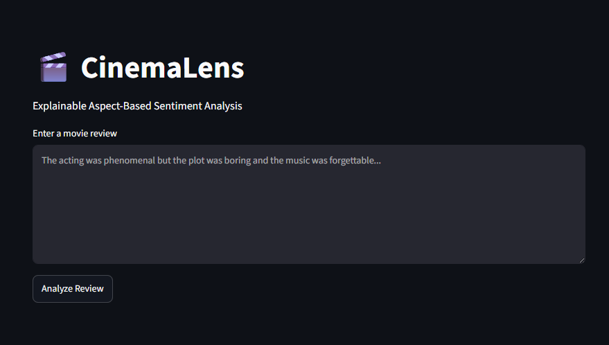
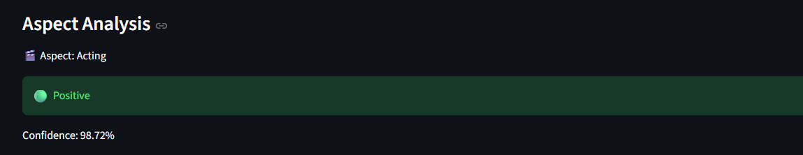
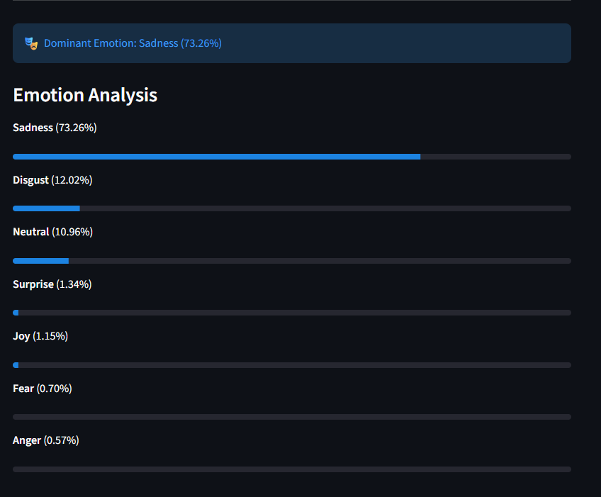
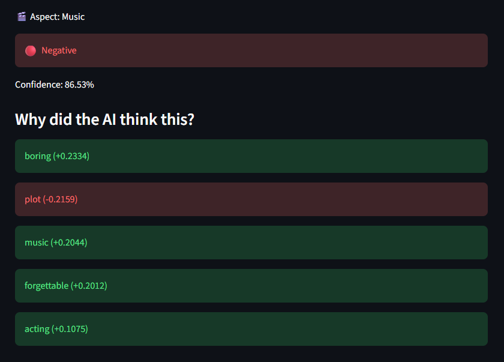

# 🎬 CinemaLens

An Explainable Aspect-Based Sentiment Analysis (ABSA) platform for movie reviews built using DeBERTa-v3, DistilRoBERTa, FastAPI, Streamlit, spaCy, and LIME.

CinemaLens goes beyond traditional sentiment analysis by identifying specific aspects mentioned in a review (such as acting, plot, music, and direction), predicting sentiment for each aspect, detecting emotions expressed in the review, and explaining predictions using LIME.

---

# Features

### Aspect-Based Sentiment Analysis (ABSA)

Extracts movie-related aspects from user reviews and predicts sentiment for each aspect individually.

Example:

**Review:**

> The acting was phenomenal but the plot was boring and the music was forgettable.

**Output:**

| Aspect | Sentiment |
| ------ | --------- |
| Acting | Positive  |
| Plot   | Negative  |
| Music  | Negative  |

---

### Emotion Detection

Identifies emotions present in a review using a transformer-based emotion classification model.

Detected emotions may include:

* Joy
* Sadness
* Anger
* Fear
* Surprise
* Disgust
* Neutral

---

### Explainable AI with LIME

CinemaLens uses LIME (Local Interpretable Model-Agnostic Explanations) to explain why a sentiment prediction was made.

Example:

| Word        | Influence |
| ----------- | --------- |
| phenomenal  | Positive  |
| acting      | Positive  |
| boring      | Negative  |
| forgettable | Negative  |

This improves transparency and trust in model predictions.

---

### Interactive Dashboard

A user-friendly Streamlit interface allows users to:

* Enter movie reviews
* View aspect-level sentiment predictions
* Analyze emotions
* Understand model decisions through LIME explanations

---

# Architecture

```text
Movie Review
      │
      ▼
Aspect Extraction (spaCy)
      │
      ▼
ABSA Classification (DeBERTa-v3)
      │
      ▼
Emotion Detection (DistilRoBERTa)
      │
      ▼
LIME Explainability
      │
      ▼
Streamlit Dashboard
```

---

# Demo

### Home Page



### Aspect Analysis



### Emotion Analysis



### LIME Explainability



---

# Evaluation Results

CinemaLens was evaluated on the official **SemEval 2014 Restaurant Reviews Aspect-Based Sentiment Analysis dataset**.

### Dataset

* SemEval 2014 Task 4 – Aspect-Based Sentiment Analysis
* Total Evaluated Samples: 3602

### Performance Metrics

| Metric    | Score  |
| --------- | ------ |
| Accuracy  | 78.85% |
| Precision | 88.07% |
| Recall    | 78.85% |
| F1 Score  | 80.88% |

### Confusion Matrix


---

# Tech Stack

## Natural Language Processing

* spaCy
* DeBERTa-v3
* DistilRoBERTa
* LIME

## Backend

* FastAPI
* Uvicorn

## Frontend

* Streamlit

## Machine Learning

* PyTorch
* Transformers
* scikit-learn

## Evaluation

* SemEval 2014 ABSA Dataset

---

# Project Structure

```text
CinemaLens/
│
├── assets/
├── backend/
├── database/
├── datasets/
├── frontend/
├── results/
├── tests/
│
├── README.md
├── requirements.txt
└── .gitignore
```

---

# Installation

### Clone Repository

```bash
git clone https://github.com/Himanshifarah55/CinemaLens.git
cd CinemaLens
```

### Create Virtual Environment

```bash
python -m venv .venv
```

### Activate Environment

Windows:

```bash
.venv\Scripts\activate
```

Mac/Linux:

```bash
source .venv/bin/activate
```

### Install Dependencies

```bash
pip install -r requirements.txt
```

### Download spaCy Model

```bash
python -m spacy download en_core_web_sm
```

---

# Running the Application

### Start Backend

```bash
uvicorn backend.main:app --reload
```

### Start Frontend

```bash
streamlit run frontend/app.py
```

---

# Future Improvements

* PostgreSQL integration for review history
* User authentication
* Docker containerization
* CI/CD with GitHub Actions
* Deployment on Hugging Face Spaces
* Fine-tuning on movie-review-specific ABSA datasets
* Real-time analytics dashboard
