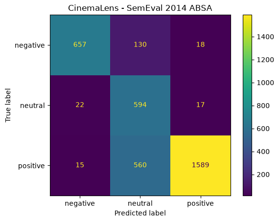

# 🎬 CinemaLens

CinemaLens is an Explainable Aspect-Based Sentiment Analysis (ABSA) platform for movie reviews.

The system analyzes reviews at the aspect level, detects emotions, and explains predictions using LIME (Local Interpretable Model-Agnostic Explanations).

---

## Features

- Aspect Extraction using spaCy
- Aspect-Based Sentiment Analysis using DeBERTa-v3
- Emotion Detection using DistilRoBERTa
- Explainable AI using LIME
- FastAPI Backend
- Streamlit Frontend

---

## Example

Review:

> The acting was phenomenal but the plot was boring and the music was forgettable.

Output:

### Aspect Analysis

| Aspect | Sentiment |
|----------|----------|
| Acting | Positive |
| Plot | Negative |
| Music | Negative |

### Emotion Analysis

- Sadness
- Disgust
- Neutral

### Explainability

The model highlights words that influenced each prediction.

Example:

- boring (+0.40)
- forgettable (+0.15)
- phenomenal (-0.08)

---

## Tech Stack

- Python
- FastAPI
- Streamlit
- Transformers
- PyTorch
- spaCy
- LIME

---

## Project Structure

```text
backend/
frontend/
database/
datasets/
README.md
requirements.txt
```

---

## Future Improvements

- PostgreSQL Integration
- Review History
- Model Fine-Tuning
- Evaluation Metrics
- Cloud Deployment

---

## Evaluation Results

CinemaLens was evaluated on the official SemEval 2014 Restaurant Reviews Aspect-Based Sentiment Analysis dataset.

| Metric | Score |
|----------|----------|
| Accuracy | 78.85% |
| Precision | 88.07% |
| Recall | 78.85% |
| F1 Score | 80.88% |

### Confusion Matrix



### Dataset

SemEval 2014 Task 4 - Aspect Based Sentiment Analysis

Total Evaluated Samples: 3602

---

## Architecture

Review
↓
Aspect Extraction (spaCy)
↓
ABSA Classification (DeBERTa-v3)
↓
Emotion Detection (DistilRoBERTa)
↓
LIME Explainability
↓
Streamlit Dashboard